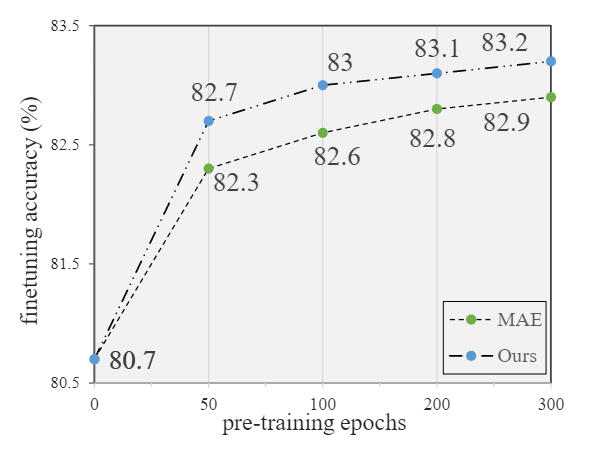

### beyond masking
**[Beyond Masking: Demystifying Token-Based Pre-Training for Vision Transformers](https://arxiv.org/pdf/2203.14313.pdf)**

The code is coming

  

Figure 1: Pipeline of token-based pre-training.

  

Figure 2: The visualization of the proposed 5 tasks.

### main results

All the results are pre-trained for 300 epochs using Vit-base as default.
<table><tbody>
<!-- START TABLE -->
<!-- TABLE HEADER -->
<th valign="bottom"></th>
<th valign="bottom">zoomed-in</th>
<th valign="bottom">zoomed-out</th>
<th valign="bottom">distorted</th>
<th valign="bottom">blurred</th>
<th valign="bottom">de-colorized</th>
<!-- TABLE BODY -->
<tr><td align="left">finetune</td>
<td align="center"><tt>82.7</tt></td>
<td align="center"><tt>82.5</tt></td>
<td align="center"><tt>82.1</tt></td>
<td align="center"><tt>81.8</tt></td>
<td align="center"><tt>81.4</tt></td>
</tr>
</tbody></table>

<table><tbody>
<!-- START TABLE -->
<!-- TABLE HEADER -->
<th valign="bottom"></th>
<th valign="bottom">zoomed-in (a)</th>
<th valign="bottom">mask (m)</th>
<th valign="bottom">(a)+(m)</th>
<!-- TABLE BODY -->
<tr><td align="left">finetune</td>
<td align="center"><tt>82.7</tt></td>
<td align="center"><tt>82.9</tt></td>
<td align="center"><tt>83.2</tt></td>
</tr>
</tbody></table>
We note that the integrated version dose not require extra computational cost.

### Effiencicy

  

Figure 3: Efficiency of the integrated task.

